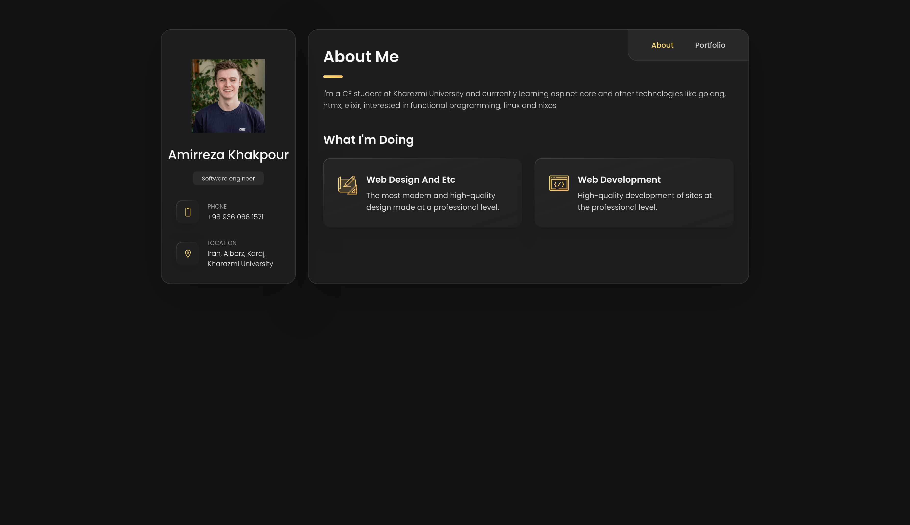
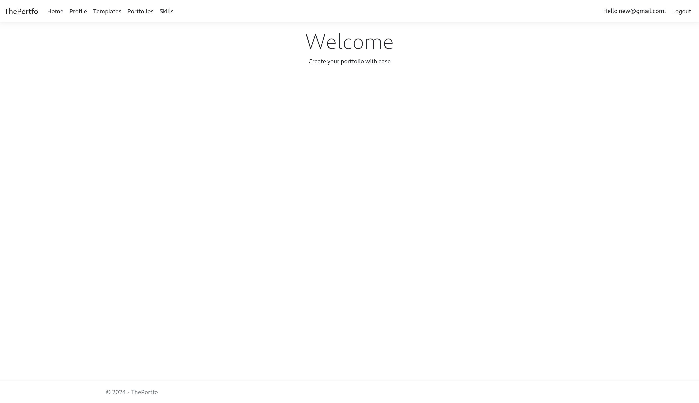
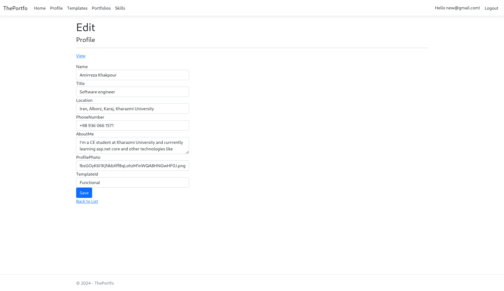

# ThePortfo

ThePortfo is a web application that allows users to create and customize their own portfolio websites. Users can register, input personal details like name, address, phone number, projects, and skills, and choose from a selection of HTML templates to display their portfolio. Additionally, users can create their own templates and share them for others to use.

## Features
- **User Registration and Authentication**
- **Portfolio Creation**:
  - Input personal details (Name, Address, Phone Number, etc.)
  - Add a list of projects and skills
  - Choose from pre-designed HTML templates
  - Create and upload custom templates for others to use
- **Responsive and customizable portfolio designs**
- **Backend developed with ASP.NET Core**

## Screenshots

Below are some screenshots of ThePortfo in action:


*Preview of a generated portfolio*


*Index page*


*Profile edit page*

## Technology Stack
- **Backend:** ASP.NET Core MVC
- **Frontend:** HTML5, CSS3, Bootstrap (for the templates)
- **Database:** SQLite (Configurable via `appsettings.json`)
- **Dependency Management:** Nix (with `flake.nix`)

## Installation

1. Clone the repository:
   ```bash
   git clone https://github.com/amirkhaki/ThePortfo
   ```

2. Navigate to the project directory:
   ```bash
   cd ThePortfo
   ```

3. Set up the development environment using `flake.nix`:
   ```bash
   nix develop
   ```

4. Update the database settings in `appsettings.json`:
   ```json
   {
     "ConnectionStrings": {
       "DefaultConnection": "Data Source=your-database.db"
     }
   }
   ```

5. Build and run the application:
   ```bash
   dotnet build
   dotnet run
   ```

6. Open the application in your browser at http://localhost:5091.

## Usage

1. Open the website in your browser at http://localhost:5091 after running the application.
2. Register a new account or log in if you already have one.
3. Fill in your personal information, projects, and skills.
4. Select a template or upload your own template for others to use.
5. Preview your portfolio and share it with others!


## Contributing

Feel free to fork this repository, create issues, and submit pull requests. Contributions are always welcome!
